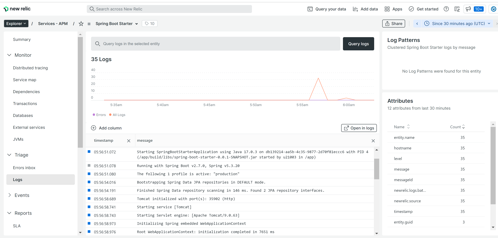

# New Relic support out of the box

The following environment variables are required to enable New Relic monitoring:

```bash
NEW_RELIC_APP_NAME=<your-app-name>
NEW_RELIC_LICENSE_KEY=<your-license-key>
```

New Relic configuration file is located at `libs/newrelic`

## Screenshot of the monitoring for the deployed application on heroku.


