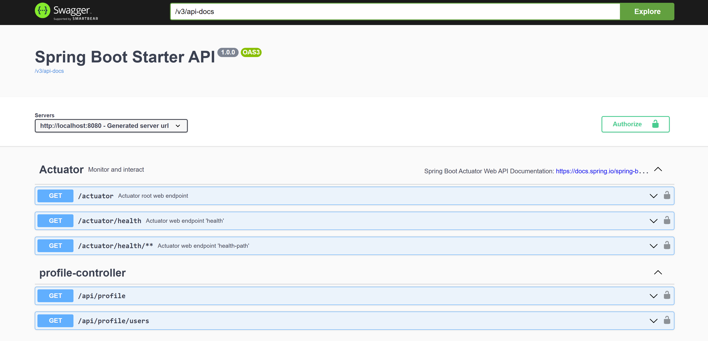
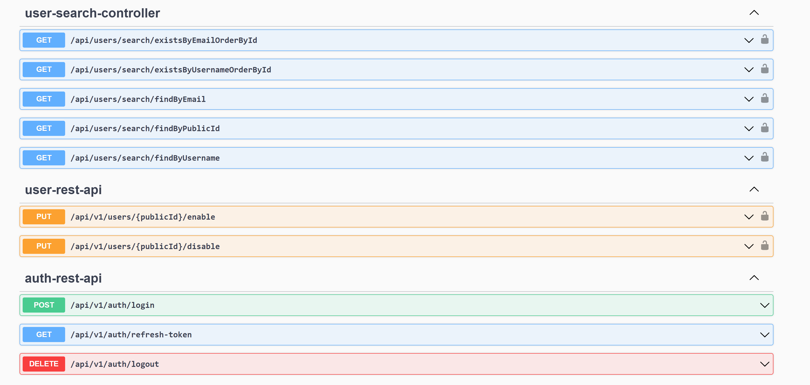

The Open API Specification (OAS) is a [JSON Schema](https://json-schema.org/).
Configuration can be found [here](/src/main/java/com/developersboard/config/OpenApi30Config.java)

* Access OpenAPI Specification: - **http://localhost:8080/v3/api-docs**
* Access Swagger UI - **http://localhost:8080/swagger-ui/index.html**

## Actuator endpoints

## User search, Authentication, and Authorization

* User search requires a valid authorization token.
* The default credentials for the user are:

        ADMIN_USERNAME=admin
        ADMIN_PASSWORD=password

* Copy and paste the **accessToken** into to *Authorize* button.

